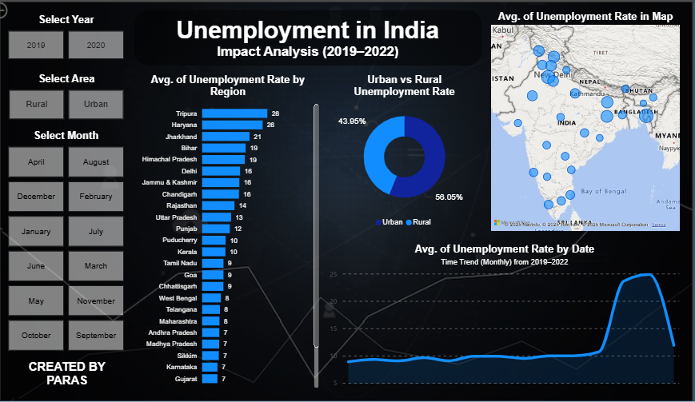

# 🧠 Unemployment Analysis | OASIS INFOBYTE – Task 1

This project dives into how **unemployment in India** evolved between **2019 and 2022**, with a sharp focus on the impact of **COVID-19**. We analyzed trends using **Excel**, **Python**, and built an **interactive Power BI dashboard** for visual storytelling.

---

## 📌 Objective

To understand **unemployment patterns** across different **states, regions, and periods**, and present them through easy-to-read charts and maps.

---

## 📊 Tools Used

- **Excel** – Data cleaning, sorting, and basic EDA  
- **Python** – (`pandas`, `matplotlib`, `seaborn`) for time-based analysis  
- **Power BI** – For building the final interactive dashboard  

---

## 🧠 Skills Applied

- Data Cleaning & Preprocessing  
- Exploratory Data Analysis (EDA)  
- Time Series Visualization  
- KPI and Dashboard Design  
- Data-Driven Storytelling  

---

## 🔍 Project Steps

1. Imported and cleaned the unemployment dataset  
2. Explored data by **region, area (urban/rural), month, and year**  
3. Highlighted the COVID-19 impact visually  
4. Created slicers and KPI visuals in Power BI  
5. Used maps, pie charts, bar graphs, and trend lines to show insights  

---

## 📈 Dashboard Sneak Peek

✅ Filters: Year, Region, Area (Urban/Rural), Month  
✅ KPI Cards: Avg. Unemployment Rate, Total Employed  
✅ Visuals: Maps, Bar Charts, Line Graphs, Pie Charts  

---

## 📁 Files Included

| File Name | Description |
|-----------|-------------|
| `Unemployment in India.csv` | Raw unemployment dataset |
| `Unemployment in India.xlsx` | Cleaned Excel version with EDA |
| `Unemployment in India.pbix` | Final Power BI dashboard |
| `Dashboard.PNG` | Dashboard screenshot |
| `Background.png` | Custom background for Power BI |
| `README.md` | Project documentation |

---

## 🏁 Final Output

A clean, interactive **dashboard** that helps users understand:
- How unemployment varied by region and over time  
- Urban vs. Rural trends  
- Impact of COVID-19 on employment levels in India

---

## 🚀 Created By

**Paras Chaturvedi**  
*Aspiring Data Analyst | OASIS INFOBYTE Intern*
