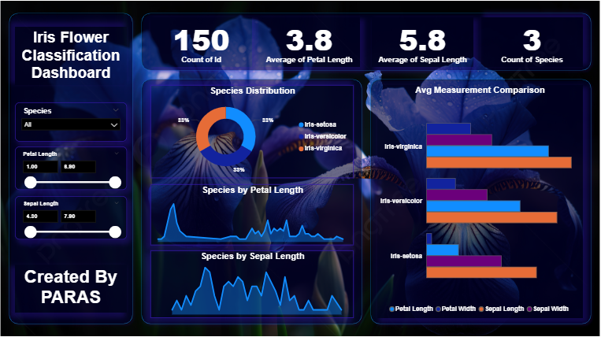

# 🌸 Iris Flower Classification Dashboard

This Power BI dashboard visually analyzes the famous **Iris flower dataset**. It helps understand the relationship between petal/sepal measurements and flower species using powerful visuals and simulated logic.

## 📊 Dashboard Preview

## 📁 Files Included

- `Iris Flower Classification.pbix` – The main Power BI dashboard file
- `Iris.csv` – The dataset used
- `BackGround.png` – Background image used in the dashboard
- `Dashboard.PNG` – Final dashboard image

## 🔍 Features

- Species distribution overview
- Petal & sepal length analysis
- Average measurement comparison
- Interactive slicers by species & measurement range
- Classification pattern insight

## 💡 Tools Used

- Power BI
- CSV Dataset (Iris)
- Custom Background Design

## 🙋 Created By

**Paras Chaturvedi**  
_Aspiring Data Analyst_  
LinkedIn: [Your LinkedIn Profile]  
Project by Internshala Data Science Program  
