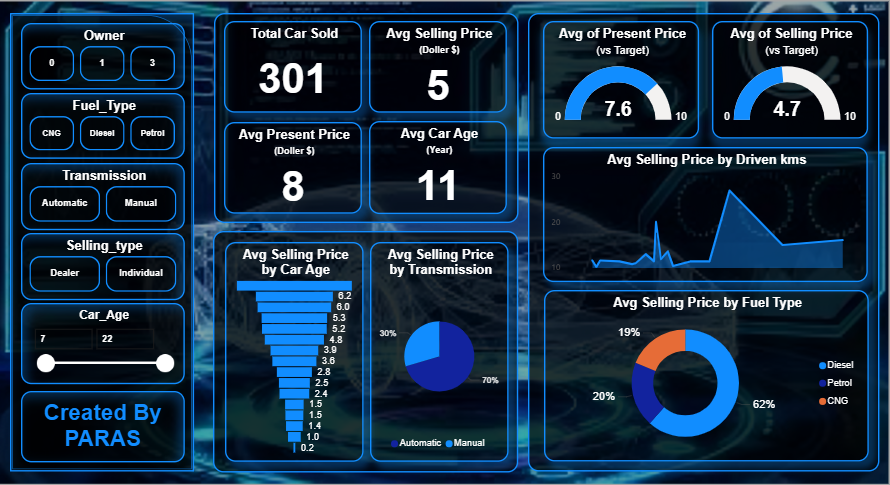

# 📊 Car Price Prediction Dashboard using Power BI

---

## 🚗 Project Overview

This Power BI project focuses on analyzing used car sales data and visualizing key insights related to car pricing, age, fuel types, and transmission. The goal is to help users understand **how various factors affect the selling price** of a car using an interactive and professional dashboard.

---

## 📁 Files Included

| File Name                    | Description                                 |
|-----------------------------|---------------------------------------------|
| `Car Price Prediction.pbix` | Power BI report file with the full dashboard |
| `car data.csv`              | Raw dataset used for the analysis           |
| `Background.png`            | Custom background used in the dashboard     |
| `Dashboard.PNG`             | Final dashboard screenshot                  |

---

## 📌 Dashboard Features

- **Total Cars Sold**
- **Average Selling and Present Price**
- **Gauge Visuals** showing price performance vs target
- **Interactive Filters**:
  - Owner count
  - Fuel Type (Diesel, Petrol, CNG)
  - Transmission (Manual, Automatic)
  - Selling Type (Dealer or Individual)
  - Car Age Range
- **Visual Charts**:
  - Selling Price by Fuel Type (Donut)
  - Selling Price by Transmission (Pie)
  - Selling Price by Car Age (Bar)
  - Price Trend by Driven Kilometers (Line)

---

## 📊 Technologies Used

- Power BI (Desktop)
- DAX for custom measures
- Excel (for initial data cleaning)
- Custom background image for enhanced visuals

---

## 📈 Key Insights

- Petrol cars make up the majority of used car sales.
- Manual transmission dominates the market (70%).
- Cars aged 5–10 years are the most commonly sold.
- Selling price correlates moderately with the present price and car age.

---

## 📷 Dashboard Preview

> A high-contrast futuristic dashboard design with slicers, KPIs, and multiple dynamic visuals for exploring used car market trends.

---

## 🚀 How to Use

1. Clone the repository or download the `.pbix` file.
2. Open the file in **Power BI Desktop**.
3. Explore the dashboard and apply filters to interact with the data.
4. Customize visuals, add your data, or publish to the Power BI service.

---

## 🙋 Created By

**Paras Chaturvedi**  
Feel free to connect or contribute!
